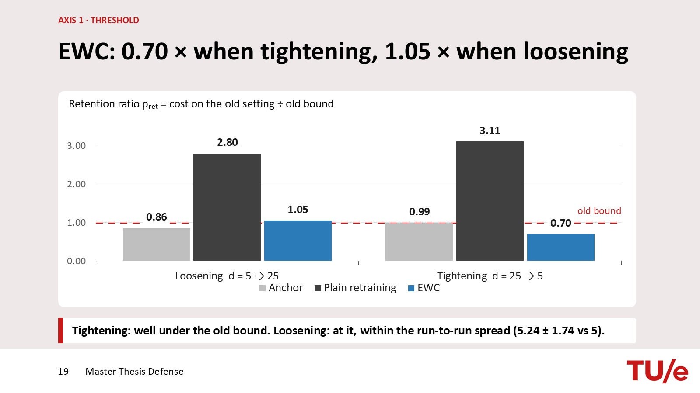
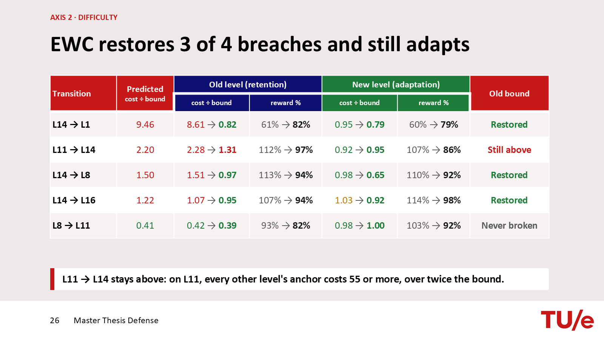
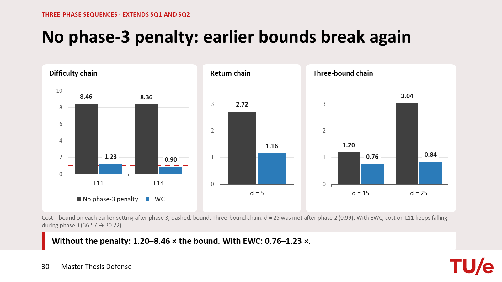

# Safety Retention under a Changing Specification

**Safe continual reinforcement learning.** MSc thesis, Eindhoven University of Technology (Data & AI), 2026.
Supervisors: Tristan Tomilin and Thiago Simão.

Safe reinforcement learning constrains an agent with a cost bound that is usually fixed before training. Deployed systems change. A bound is tightened after an incident, or loosened once a system has proved reliable, and an agent certified under the old bound is retrained under the new one. This thesis asks what a safe agent forgets when the setting it was certified in changes, and whether the answer depends on the kind of change.

The code is a fork of [CRAX](https://github.com/TTomilin/CRAX), a JAX/Brax safe RL benchmark. It is published as a record of the work, not as a turnkey reproduction: every run was a 500M-step SLURM job on a GPU cluster.

## The question and the setup

> When the setting a safe agent was certified in changes, what does it forget, what does it retain, and does the answer depend on the kind of change?

Each experiment trains an agent on one setting (phase 1, the *anchor*), retrains it on a second (phase 2), then tests it on both. Retention is measured as cost on the old setting divided by the old bound (ρ_ret ≤ 1 means the old certification still holds).

| Axis | What changes | Runs |
|---|---|---|
| Threshold | the bound d (5 ↔ 25) on level L14 | 5 seeds |
| Difficulty | the level: hazard layout or goal speed, five transitions at d = 25 | 3–5 seeds |
| Task | Goal ↔ Push, observations padded to a common width | 3 seeds |
| Three phases | three chains of three settings, with and without a phase-3 penalty | 5 seeds |

The safe RL learner is P3O, with the bound and the remaining budget given to the policy as inputs. Retraining is either plain or regularised with EWC. Four arms are compared, differing only in the per-weight importance F_i: plain retraining (λ = 0), the standard Fisher, a cost-aware Fisher, and uniform anchoring (F_i = 1).

## Findings

- **Plain retraining breaks the old bound in both directions** of a threshold change, at 2.8 and 3.1 times the bound, even though the old bound is an input to the policy throughout.
- **EWC gets back to the old bound both ways, at very different prices.** When tightening it is almost free; when loosening it gives up 45% of the new reward.
- **Safety forgetting can be predicted before retraining.** Testing the new level's agent on the old level predicts the cost after plain retraining to within 13% on all seven transitions run.
- **Reward and safety are forgotten separately.** On the task axis reward partly returns while cost stays at about twice the bound or more, and standard reward-based forgetting metrics miss the breach.
- **Which weights are held does not matter here.** Uniform anchoring retains as well as the Fisher, and the cost-weighted Fisher of Coursey et al. (2026) equals the standard Fisher on safe agents (cosine similarity 1.0000 over 76 anchors).





The full talk, including the appendix of design decisions and result tables, is in [`docs/defense_slides.pdf`](docs/defense_slides.pdf).

## What this fork adds to CRAX

| Path | Change |
|---|---|
| `brax/envs/difficulty.py` | Push levels L4–L16, built to give a real reward–cost trade-off (L14 is the main testbed) |
| `brax/envs/wrappers/threshold_budget.py` | appends the bound and the remaining episode budget to the observation |
| `brax/envs/wrappers/pad_obs.py` | zero-pads Goal observations to Push width, so one network serves both tasks |
| `brax/training/agents/p3o_budget/` | phase-1 agent: P3O with the budget wrappers |
| `brax/training/agents/p3o_ewc/` | phase-2 agent: warm-starts from an anchor and adds the EWC penalty |
| `brax/training/agents/p3o/losses.py` | EWC hook in the P3O loss |
| `brax/training/agents/ppo/train.py` | saves and restores the cost critic with the policy |
| `brax/training/acme/running_statistics.py` | exempts the two budget channels from observation normalisation |
| `brax/training/agents/ppo_pid_budget/`, `ppo_saute/` | variants used to compare P3O with a Lagrangian method and to test Saute RL |

Everything else under `brax/` is upstream CRAX and Brax.

## Layout

```
train_env.py, run_utils.py   training entry point (from CRAX; the new agents are registered in run_utils.py)
compute_fisher.py            importance maps of an anchor: standard, cost-aware and cost-weighted Fisher
tb_condition_eval.py         evaluates a checkpoint across a range of bounds
configs/                     command-line options, including the new levels
brax/                        the CRAX fork (see above)
slurm/                       job scripts: phase-1 anchors and checkpoint evaluation
results/                     result tables behind the thesis (see results/README.md)
docs/                        defense slides and the figures above
```

## How runs were launched

All runs were SLURM jobs on GPU nodes, 500M environment steps per phase (about 3–4 hours each), seeds 901–905, submitted from the repo root.

```bash
# phase 1: an anchor on L14 at bound 5 (trains, then evaluates across bounds)
sbatch --export=ALL,ENV=safe_push_point,DIFF=14,SUB=nosink,D=5,SEED=901,NORM=by_const,STEPS=500e6,LR=1e-3,ENT=1e-2,HPTAG=lr1e3ent slurm/diag_probe.sh

# importance maps of that anchor
python compute_fisher.py <anchor checkpoint> 5 fisher/L14_d5_s901.pkl safe_push_point 14

# phase 2: warm-start from the anchor, loosen the bound to 25, EWC with the standard Fisher at λ = 0.1
RESTORE_CKPT=<anchor checkpoint> EWC_FISHER_PATH=fisher/L14_d5_s901.pkl EWC_FISHER_B=F_vanilla EWC_COEF=0.1 \
BUDGET_NORM=by_const TB_EXEMPT_LAST2=1 \
python train_env.py --alg p3o_ewc --env_name safe_push_point --difficulty 14 --safety_bound 25 \
  --learning_rate 1e-3 --entropy_cost 1e-2 --num_timesteps 500000000 --seeds 901
```

In phase 2, `EWC_FISHER_B` picks the arm: `F_vanilla` (standard Fisher), `F_cost_realvb` (cost-aware), or `ONES` (uniform anchoring). `EWC_COEF=0` gives plain retraining.

Installation follows CRAX: `pip install -r requirements.txt` (JAX 0.6 with CUDA 12, MuJoCo MJX 3.3).

## License and acknowledgements

Apache License 2.0, as for CRAX and Brax. Built on [CRAX](https://github.com/TTomilin/CRAX) (Tomilin et al., 2026), [Brax](https://github.com/google/brax) and [MuJoCo MJX](https://mujoco.readthedocs.io/en/stable/mjx.html).
